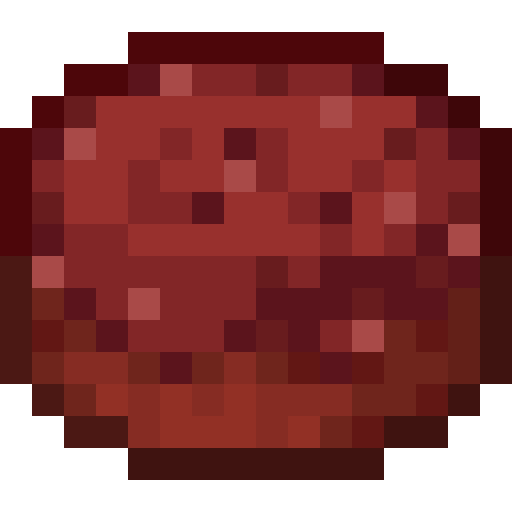

<h1 align="center">More Food Mod  
    
    
    
      
</h1>
The MoreFood mod is a Minecraft mod that adds 100+ new food items, including crops, fruits, cooked dishes, fast food, desserts, snacks, and even a new villager and building blocks.
